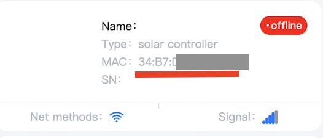

# BL917 Solar Charge Controller Client

A simple Python client for interacting with the BL917 solar charge controller via its websocket API.


## Prerequesites

In order to use the client, you will need to:

1. Register an account on the ZhiJinPower app: 
   * [iOS](https://apps.apple.com/fr/app/%E6%9E%9D%E6%99%8B%E8%83%BD%E6%BA%90zhijinpower/id6450771899?l=en-GB)
   * Android (⚠️ unverified [APK](https://fir.xcxwo.com/j73q9l))
2. Pair your device with the app. Good luck, that app is terrible.
3. Write down the MAC address of the device:



## Supported model

The only confirmed compatible model is this one, sold under multiple names (including BL917) on marketplaces.
Only the wifi version is compatible:


If your controller looks different but uses the ZhiJinPower app, then it might be compatible.

## API note

The API works via some server in China. It is somewhat finicky and unreliable. Somme commands sometimes won't be acknowledged, and might need to be run multiple times to be registered.

The API has no authentication whatsoever: only the device MAC address needs to be passed to run commands (Yes, it is... bad).

Supported commands that I found:
- get all info (voltage, temperature, settings, etc)
- set charge mode and voltage values
- toggle 12v output

[Read more](API_REVERSE_ENGINEERING.md)

## Command support

  - Get/set charge mode
  - Get load state
  - Get all device information

## Requirements

- Python 3.7+
- websockets library

## Installation

1. Clone this repository
2. Install dependencies:

```pip install -r requirements.txt```

## Usage

> ⚠️ **Warning**
> 
> Use these commands carefully: they will be executed immediately by the controller.

```bash
# Get the current charge mode
python client.py --mac XX:XX:XX:XX:XX--command get-charge-mode

# Set the charge mode to manual (0)
python client.py --mac XX:XX:XX:XX:XX--command set-charge-mode --value 0

# Get the load state
python client.py --mac XX:XX:XX:XX:XX --command get-load-state
```

Expected output:
```
2025-08-09 20:07:13,436 - SolarControllerClient - INFO - Connection attempt 1 of 3...
2025-08-09 20:07:19,096 - SolarControllerClient - ERROR - Connection timed out after 5 seconds
2025-08-09 20:07:19,419 - SolarControllerClient - INFO - Retrying in 2 seconds...
2025-08-09 20:07:21,421 - SolarControllerClient - INFO - Connection attempt 2 of 3...
2025-08-09 20:07:22,878 - SolarControllerClient - INFO - Connected successfully. Client ID: 7f00000111f80005c584
2025-08-09 20:07:24,194 - SolarControllerClient - INFO - Current charge mode: straight out (3)
2025-08-09 20:07:24,538 - SolarControllerClient - INFO - Disconnected from server
```